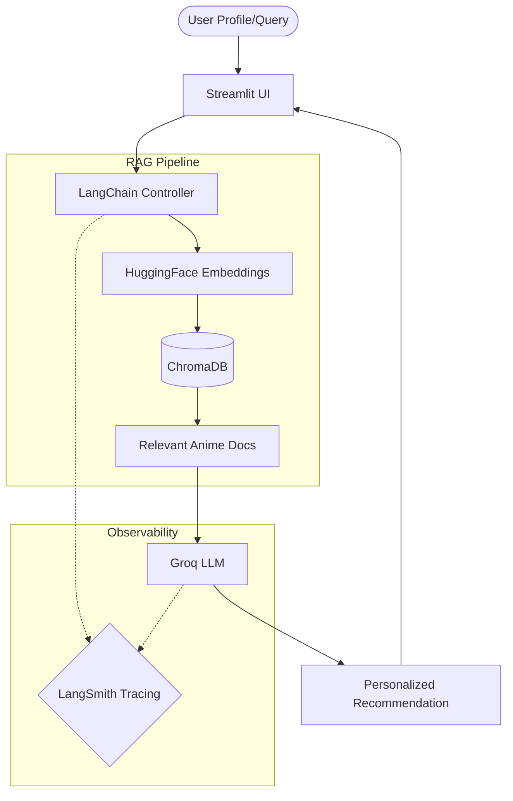
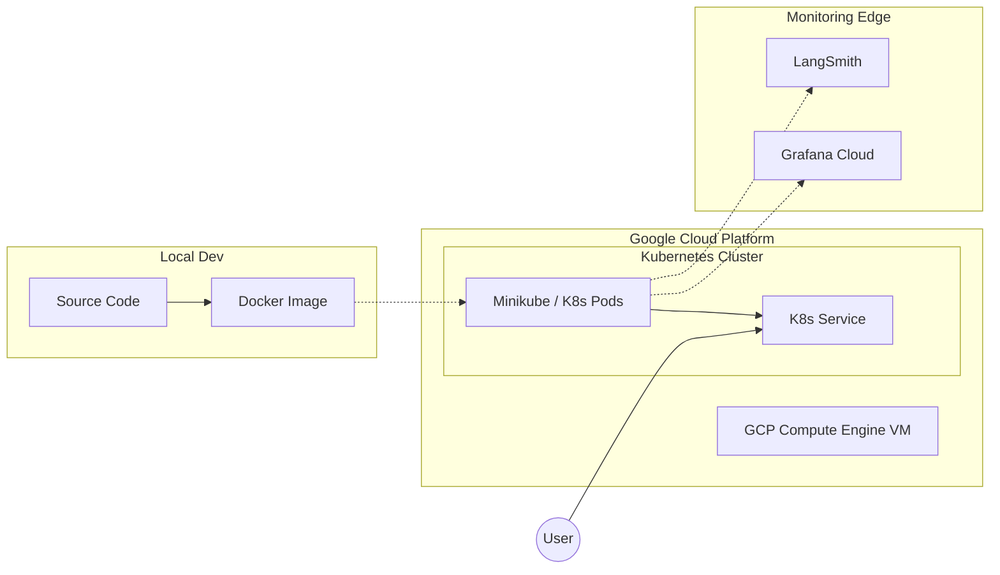
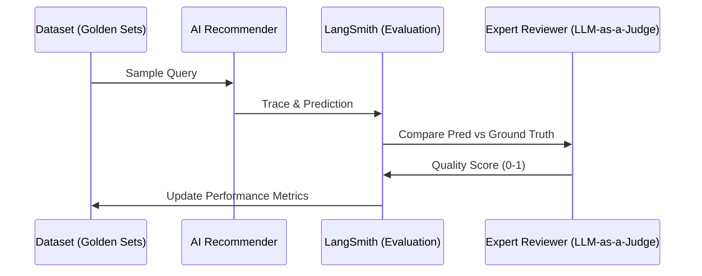

# 🌸 AniRecym: AI Anime Recommender
### *RAG, Evaluation & Observability at Scale*

Hey there! 👋 Welcome to **AniBaba**, my AI-powered anime recommendation engine. 

I built this because finding the next anime to binge shouldn't feel like a chore. I wanted to move beyond basic LLM wrappers and build something robust—a full-stack **Retrieval-Augmented Generation (RAG)** system focused on reliability, observability, and scientific evaluation. It actually understands your preferences and backs up its suggestions with real data.

---

## 🛠️ The Tech Stack

I used a modern AI engineering toolkit for this project:

| Category | Technology Used |
| :--- | :--- |
| **Brain (LLM)** | [Groq (Qwen / Llama 3)](https://groq.com/) |
| **Orchestration** | [LangChain](https://www.langchain.com/) |
| **Memory (Vector DB)** | [ChromaDB](https://www.trychroma.com/) |
| **Visuals (Frontend)** | [Streamlit](https://streamlit.io/) |
| **Observability** | [LangSmith](https://www.langchain.com/langsmith) |
| **Infrastructure** | **Docker** & **Kubernetes (Minikube)** |
| **Cloud Platform** | **Google Cloud Platform (GCP)** |
| **Cloud Monitoring** | **Grafana Cloud** |

---

## 🧠 System Architecture

The core of AniBaba is a RAG pipeline. This ensures recommendations are grounded in an actual database of anime (preventing hallucinations) while still being highly conversational.



---

## 🚀 Getting Started (Local Development)

Want to run it on your own machine? It's super straightforward:

1. **Clone the repo** and ensure you have Python 3.10+
2. **Install dependencies:** `pip install -r requirements.txt`
3. **Set up your environment variables** in a `.env` file (you'll need `GROQ_API_KEY` and `HF_TOKEN`). You can use `.env.copy` as a template.
4. **Run the UI:** 
   ```bash
   # Run the main chat interface
   streamlit run app/app2.py
   ```
5. **Alternatively, use Docker:** `docker build -t anibaba-recommender .`

---

## ☁️ Deployment & Infrastructure

I built this with a professional **Development-to-Production** workflow in mind, taking it from my local environment to a robust cloud setup on GCP.



- **Orchestration**: I use **Minikube** inside a GCP VM to manage Kubernetes pods, keeping it scalable.
- **Security**: API keys and tokens are securely managed via **Kubernetes Secrets**.
- **Observability**: Real-time cluster metrics are streamed to **Grafana Cloud** so I can keep an eye on infrastructure health.

---

## 🔬 Evaluation Workflow

I'm a big believer in *"what gets measured, gets improved."* To make sure the AI actually gives *good* recommendations, I set up an automated evaluation pipeline.



---

## 🔍 Why LangSmith? (My "Magic Mirror")

Building with LLMs can feel like talking into a void. You send a prompt, you get a response, but figuring out *why* the model said what it did is tough. 

I integrated **LangSmith** to act as my flashlight:
1. **Debugging the Black Box**: I can see every step of the chain, from the raw prompt to the exact chunks of text retrieved from ChromaDB.
2. **Performance Metrics**: Tracking latency, token usage, and costs in real-time.
3. **Regression Testing**: If I tweak a prompt, LangSmith immediately tells me if the recommendation quality dropped.
4. **Dataset Management**: I can turn problematic queries into test cases with a single click.

*Without observability, you're just guessing. With LangSmith, you're engineering.*

---

## 📚 Deep Dive Documentation

If you want to look under the hood, I've written extensive documentation covering every aspect of this project.

Check out the `docs/` folder:
- **[Architecture Overview](docs/01_introduction_and_architecture.md)**: How the gears turn.
- **[Evaluation Framework](docs/03_evaluation_framework.md)**: How I measure quality.
- **[Observability Details](docs/04_observability_and_tracing.md)**: Deep dive into LangSmith integration.
- **[Deployment Guide](docs/09-CLOUD%20DEPLOYMENTT.md)**: Full walkthrough for GCP, Docker, and K8s.

---
*Made with ❤️ for the Anime Community.*
